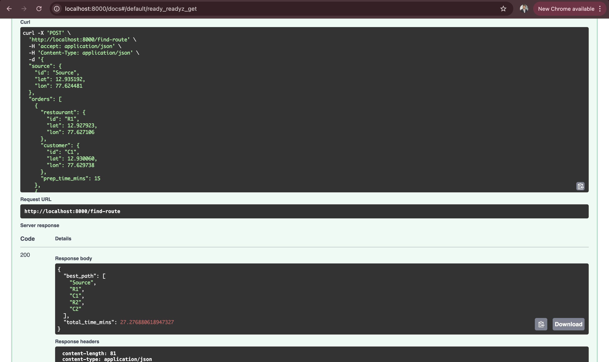

# Lucidity Backend: Route Optimizer

This project is a solution for the backend developer assignment. It provides a FastAPI endpoint to find the
optimal delivery route for a batch of $N$ orders to be delivered in the shortest possible timeframe.

The core problem is a variation of the Traveling Salesperson Problem (TSP) with the added complexity of conditional "
wait times." The total time for any route is not just travel time, but `Total Travel Time + Total Wait Time`.

The algorithm correctly calculates this by:

1. Modeling the problem with 5 key locations: Source (Aman's start), R1, C1, R2, and C2.
2. Understanding that meal preparation ($pt1$, $pt2$) starts at $t=0$.
3. If the driver arrives at a restaurant *before* the meal is ready, they must wait. The total time elapsed for that
   stop becomes $\max(\text{arrivalTime}, \text{prepTime})$.
4. The algorithm generates all valid permutations of visits (e.g., $R_1$ must precede $C_1$) and calculates the total
   time for each.
5. It then returns the path with the minimum total time.

---

## 🛠 Prerequisites

* Docker
* Docker Compose

---

## 🏃‍♀️ How to Run

1. **Clone the repository / Create the files:**
   Ensure all the files (`Dockerfile`, `docker-compose.yml`, `requirements.txt`, etc.) are in a single directory.

2. **Build and Run the Container:**
   From the root of the project directory, run:
   ```bash
    docker-compose up --build
   ```
   The API will be running at `http://localhost:8000`.

3. **Access the API Docs:**
   Open your browser and navigate to `http://localhost:8000/docs` to see the interactive FastAPI documentation.

---

## 🧪 Running Tests

To run all test cases inside the Docker environment:

```bash
  docker compose run --rm api bash scripts/test.sh
````
---

## ⚙️ Configuration

This service uses environment variables via Pydantic Settings (`app/infrastructure/settings.py`). You can set them in your shell or a `.env` file in the project root.

- `AVERAGE_SPEED_KMPH` (default: `20.0`)
- `EARTH_RADIUS_KM` (default: `6371.0`)

Example `.env`:
```env
AVERAGE_SPEED_KMPH=25
EARTH_RADIUS_KM=6371
```

Rebuild the container after changing dependencies or `.env`:
```bash
  docker-compose up --build
```

---

## 🔬 How to Test the Endpoint

You can use the `/docs` page or send a `curl` request from your terminal.

Since no coordinates were provided in the prompt, this example uses sample coordinates for Koramangala (Source) and
nearby areas.

**Example `curl` Request:**

```bash

curl -X 'POST' \
  'http://localhost:8000/find-route' \
  -H 'accept: application/json' \
  -H 'Content-Type: application/json' \
  -d '{
  "source": {
    "id": "Source",
    "lat": 12.935192,
    "lon": 77.624481
  },
  "orders": [
    {
      "restaurant": {
        "id": "R1",
        "lat": 12.927923,
        "lon": 77.627106
      },
      "customer": {
        "id": "C1",
        "lat": 12.930060,
        "lon": 77.629738
      },
      "prep_time_mins": 15
    },
    {
      "restaurant": {
        "id": "R2",
        "lat": 12.932145,
        "lon": 77.620132
      },
      "customer": {
        "id": "C2",
        "lat": 12.938743,
        "lon": 77.618339
      },
      "prep_time_mins": 25
    }
  ]
}'
```

**Example JSON Response:**

This will return the optimal path and the total time in minutes.

```json
{
  "best_path": [
    "Source",
    "R1",
    "R2",
    "C1",
    "C2"
  ],
  "total_time_mins": 46.49132338561066
}
```

*(Note: The exact path and time will depend on the coordinates and prep times you provide.)*




---

## Project Structure

```text
BestRoute/
├─ app/
│  ├─ main.py                      # FastAPI app factory, registers routers and errors
│  ├─ api/
│  │  ├─ routers/
│  │  │  └─ routes.py             # `/find-route` endpoint
│  │  ├─ deps.py                  # Dependency injection wiring (DI)
│  │  └─ errors.py                # Centralized exception handlers
│  ├─ schemas/
│  │  └─ route.py                 # API DTOs: RouteRequest, RouteResponse
│  ├─ core/
│  │  ├─ domain/
│  │  │  ├─ entities.py           # Domain entities: Location, Order
│  │  │  └─ ports.py              # Interfaces (ports): calculators, generators, optimizer
│  │  └─ services/
│  │     ├─ path_generator.py     # Generates valid permutations (R_i before C_i)
│  │     ├─ cost_calculator.py    # Computes total time (travel + wait)
│  │     └─ route_optimizer.py    # Orchestrates to find best path
│  └─ infrastructure/
│     ├─ distance/
│     │  ├─ haversine_calculator.py  # DistanceCalculator adapter (Haversine)
│     │  └─ speed_config.py          # ConstantSpeedEstimator adapter
│     ├─ logging/
│     │  └─ config.py              # setup_logging
│     └─ settings.py               # Pydantic Settings (env-driven config)
├─ images/
│  └─ api_testing.png              # Screenshot(s) for documentation
├─ Dockerfile                      # App image definition (uvicorn server)
├─ docker-compose.yml              # Local dev orchestration (port mapping, reload)
├─ requirements.txt                # Python dependencies
└─ readme.md                       # Documentation and usage guide
```

### What each part does

- `app/main.py`: Creates the FastAPI app, registers routers and error handlers, startup logging
- `app/api/routers/routes.py`: HTTP endpoints (`POST /find-route`, `GET /healthz`, `GET /readyz`)
- `app/api/deps.py`: Wires domain services and infrastructure adapters through DI
- `app/schemas/route.py`: API schemas (Pydantic models) for request/response
- `app/core/domain/*`: Pure domain — entities and interfaces (ports)
- `app/core/services/*`: Domain services — path generation, cost calculation, route optimization
- `app/infrastructure/distance/*`: Technical adapters — Haversine distance, constant speed estimator
- `app/infrastructure/logging/config.py`: Central logging configuration
- `app/infrastructure/settings.py`: Environment-driven configuration via Pydantic Settings
- `images/`, `Dockerfile`, `docker-compose.yml`, `requirements.txt`: tooling and assets

